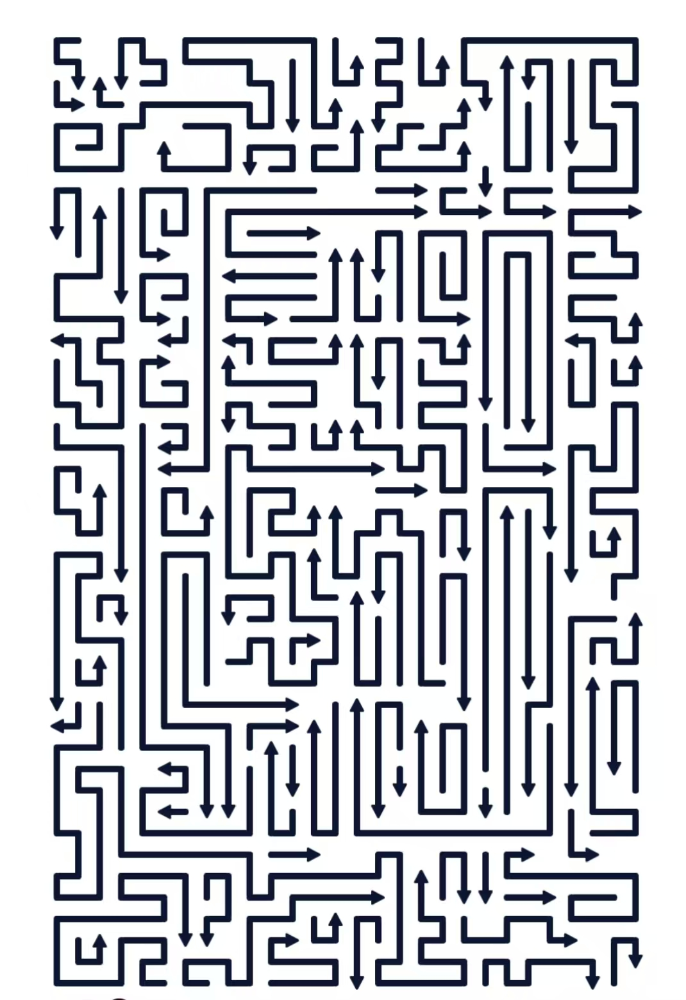

# 挪了个箭

一款竖屏箭头消除益智游戏，线条像迷宫一样弯折，点对了就飞走，点错了就掉血。



## 亮点

- 竖屏单手就能玩，节奏轻快。
- 每条箭头都是一段折线，视觉上更像迷宫。
- 关卡由规则自动生成，难度会逐步抬升。
- 提示和求解共用同一套逻辑，降低“提示失真”。
- 当前规则下，自己身体也会阻挡自己的射线路径。

## 怎么玩

1. 点击一条箭头线。
2. 如果它头部前方没有被挡住，就会飞出并消除。
3. 如果被挡住，就会失败并扣血。
4. 连续清空所有棋子，通关进入下一关。

## 界面说明

- `⚙`：暂停 / 设置
- `☰`：关卡选择
- 中间：关卡、生命值、倒计时
- `💡`：提示

## 运行方式

```bash
npm install
npm run dev
```

常用命令：

```bash
npm run build
npm test
npm run preview
```

## 技术栈

- `Vite`
- `TypeScript`
- `Vitest`
- `SVG` 渲染

## 项目结构

- `src/main.ts`：入口
- `src/gameController.ts`：游戏流程、点击、计时、通关
- `src/gridLogic.ts`：判定、求解、难度评分
- `src/levels.ts`：关卡生成
- `src/renderer.ts`：渲染和动画
- `src/levelRules.json`：关卡参数和难度曲线

## 关卡生成

关卡不是手工摆出来的，而是按规则自动生成：

1. 构造覆盖全盘的蛇形路径。
2. 用 `backbite` 随机化制造弯折。
3. 切分成多段箭头棋子。
4. 用求解器筛选可解局面，再按目标难度挑选。

## 算法简介

- **可消除判定**：沿箭头头部方向向前扫描，前方只要出现任意棋子就视为被挡住。
- **求解逻辑**：反复找出当前能消除的棋子，直到清空或卡死。
- **提示逻辑**：直接使用求解结果里的第一步，保证提示和答案一致。
- **难度控制**：通过关卡尺寸、棋子段长、路径弯折强度和时间限制逐步抬升难度。

## 说明

- 单机前端项目，进度保存在浏览器 `localStorage`
- 默认共有 10 关
- 第 10 关接近高密度迷宫风格

## 开源协议

本项目采用 `MIT License` 开源，详见 [LICENSE](LICENSE)。
